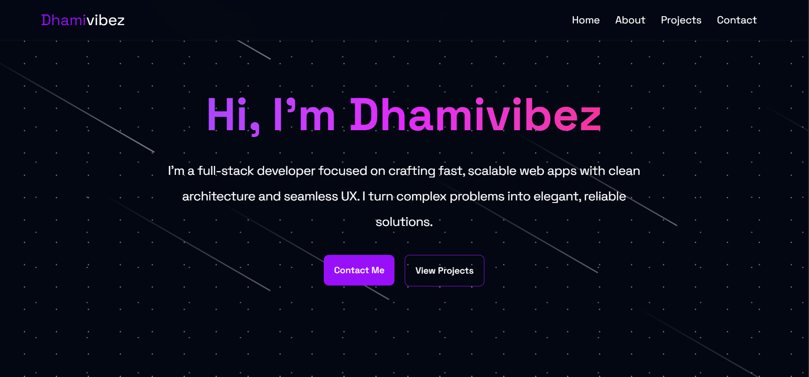

# Jafar Abdulsalam

I’m a full-stack developer focused on crafting fast, scalable web apps with clean architecture and seamless UX. I turn complex problems into elegant, reliable solutions.

---

##  Tech I Use

**Languages**  
TypeScript

**Frameworks**  
React · Express · Hono · Elysia

**Tools & Platforms**  
PNPM · Bun · Vite · Supabase

---

##  What I’ve Built

This portfolio showcases a collection of projects I’ve built that reflect how I think, solve problems, and build interfaces.  
It features:

- Smooth animations  
- Responsive design  
- Highlighted projects  
- Contact form  
- Custom layouts & components

---

## Explore My Work

> [dhamivibez.pages.dev](https://dhamivibez.pages.dev)

---

## Connect With Me

- [LinkedIn](https://linkedin.com/in/dhamivibez)  
- [GitHub](https://github.com/dhamivibez)  
- [X (Twitter)](https://x.com/0xdhamivibez)

---
